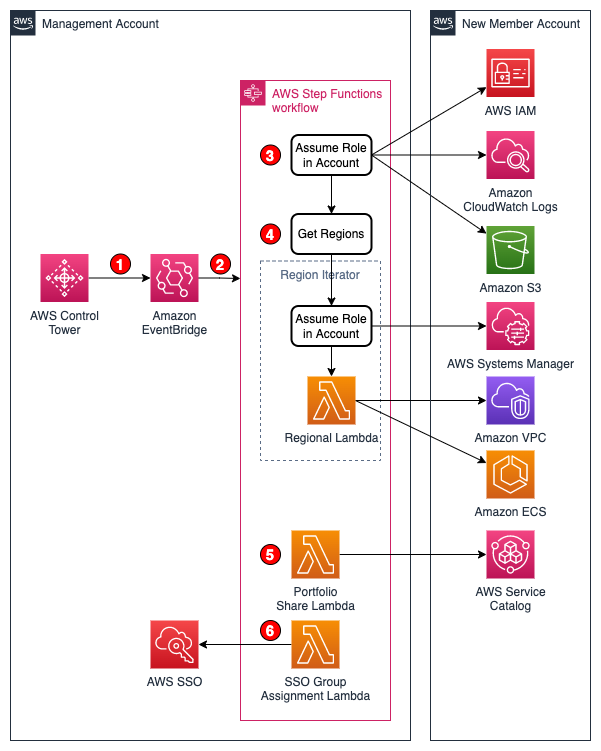

# Automate activities in Control Tower provisioned AWS accounts

### Table of contents

1. [Introduction](#introduction)
2. [Architecture](#architecture)
3. [Prerequisites](#prerequisites)
4. [Tools and services](#tools-and-services)
5. [Usage](#usage)
6. [Clean up](#clean-up)
7. [Reference](#reference)
8. [Contributing](#contributing)
9. [License](#license)

## Introduction

This project will configure the following settings on a new AWS account provisioned by [AWS Control Tower](https://aws.amazon.com/controltower/):

1. Deletes the [default VPC](https://docs.aws.amazon.com/vpc/latest/userguide/default-vpc.html) in every region
2. Adds a CloudWatch Logs resource policy that allows Route53 to [log DNS requests](https://docs.aws.amazon.com/Route53/latest/DeveloperGuide/query-logs.html) to CloudWatch in the us-east-1 (Northern Virginia) region
3. Enables the account-wide public [S3 block setting](https://docs.aws.amazon.com/AmazonS3/latest/userguide/configuring-block-public-access-account.html)
4. Modifies account-level ECS [settings](https://docs.aws.amazon.com/AmazonECS/latest/developerguide/ecs-account-settings.html)
5. Associates [specific principals](https://docs.aws.amazon.com/servicecatalog/latest/adminguide/catalogs_portfolios_users.html) to shared AWS Service Catalog portfolios
6. Grants specific AWS SSO [groups](https://docs.aws.amazon.com/singlesignon/latest/userguide/users-groups-provisioning.html) access to the new account
7. Blocks [public SSM document sharing](https://docs.aws.amazon.com/systems-manager/latest/userguide/ssm-share-block.html)
8. Enables [EBS encryption by default](https://docs.aws.amazon.com/AWSEC2/latest/UserGuide/EBSEncryption.html#encryption-by-default)
9. Applies an [IAM password policy](https://docs.aws.amazon.com/IAM/latest/UserGuide/id_credentials_passwords_account-policy.html) that complies with the [CIS AWS Foundations Benchmark](https://docs.aws.amazon.com/securityhub/latest/userguide/securityhub-cis-controls.html)

## Architecture



1. When [AWS Control Tower](https://aws.amazon.com/controltower/) provisions a new account, a [CreateManagedAccount](https://docs.aws.amazon.com/controltower/latest/userguide/lifecycle-events.html#create-managed-account) event is sent to the [Amazon EventBridge](https://aws.amazon.com/eventbridge/) default event bus.
2. An Amazon EventBridge rule matches the `CreateManagedAccount` event and triggers an [AWS Step Functions](https://aws.amazon.com/step-functions/) state machine that executes [AWS Lambda](https://aws.amazon.com/lambda/) functions.
3. The "Account Lambda" function assumes the `AWSControlTowerExecution` IAM role in the new account and adds the account-level [S3 public block setting](https://docs.aws.amazon.com/AmazonS3/latest/userguide/configuring-block-public-access-account.html), creates a CloudWatch Logs resource policy in the us-east-1 region that allows Route 53 to write DNS [query logs](https://docs.aws.amazon.com/Route53/latest/DeveloperGuide/query-logs.html#query-logs-configuring) to CloudWatch
4. Step Functions then uses the [AWS SDK service integration](https://docs.aws.amazon.com/step-functions/latest/dg/supported-services-awssdk.html) to call `ec2:DescribeRegions` to get a list of regions
5. The "Regional Lambda" function assumes the `AWSControlTowerExecution` IAM role in the new account and enables various ECS [settings](https://docs.aws.amazon.com/AmazonECS/latest/developerguide/ecs-account-settings.html), deletes the [default VPC](https://docs.aws.amazon.com/vpc/latest/userguide/default-vpc.html) from every region, enables [EBS encryption by default](https://docs.aws.amazon.com/AWSEC2/latest/UserGuide/EBSEncryption.html#encryption-by-default), and blocks [public SSM document sharing](https://docs.aws.amazon.com/systems-manager/latest/userguide/ssm-share-block.html)
6. The "Portfolio Share Lambda" function assumes the `AWSControlTowerExecution` IAM role in the new account and accepts shared Service Catalog portfolios in the new account and grants specific principals access to those portfolios.
7. The "SSO Group Assignment Lambda" function assigns any AWS SSO groups that start with `AWS-O-<PermissionSetName>` access to the new account with the `<PermissionSetName>` permission set.

## Prerequisites

- [Python 3](https://www.python.org/downloads/), installed
- [AWS Command Line Interface (AWS CLI)](https://docs.aws.amazon.com/cli/latest/userguide/install-cliv2.html) version 2, installed
- [AWS Serverless Application Model (SAM)](https://docs.aws.amazon.com/serverless-application-model/latest/developerguide/serverless-getting-started.html), installed
- [Docker Desktop](https://www.docker.com/products/docker-desktop), installed

## Tools and services

- [AWS SAM](https://aws.amazon.com/serverless/sam/) - The AWS Serverless Application Model (SAM) is an open-source framework for building serverless applications. It provides shorthand syntax to express functions, APIs, databases, and event source mappings.
- [AWS Lambda](https://aws.amazon.com/lambda/) - AWS Lambda is a serverless compute service that lets you run code without provisioning or managing servers, creating workload-aware cluster scaling logic, maintaining event integrations, or managing runtimes.
- [AWS Control Tower](https://aws.amazon.com/controltower/) - AWS Control Tower provides the easiest way to set up and govern a secure, multi-account AWS environment, called a landing zone.
- [AWS Organizations](https://aws.amazon.com/organizations/) - AWS Organizations helps you centrally manage and govern your environment as you grow and scale your AWS resources.
- [Amazon EventBridge](https://aws.amazon.com/eventbridge/) - Amazon EventBridge is a serverless event bus service that you can use to connect your applications with data from a variety of sources.
- [AWS Service Catalog](https://aws.amazon.com/servicecatalog/) - AWS Service Catalog allows organizations to create and manage catalogs of IT services that are approved for use on AWS.
- [AWS Single Sign-On](https://aws.amazon.com/single-sign-on/) - AWS Single Sign-On (AWS SSO) is where you create, or connect, your workforce identities in AWS once and manage access centrally across your AWS organization.
- [AWS Systems Manager](https://aws.amazon.com/systems-manager/) - Systems Manager provides a unified user interface so you can track and resolve operational issues across your AWS applications and resources from a central place.

## Usage

#### Parameters

| Parameter                |  Type  |                       Default                        | Description                                                    |
| ------------------------ | :----: | :--------------------------------------------------: | -------------------------------------------------------------- |
| OrganizationGroups       | String |                      us-east-1                       | List of AWS SSO groups that should have access to all accounts |
| ExecutionRoleName        | String |               AWSControlTowerExecution               | Execution IAM role name                                        |
| PortfolioIds             | String |                        _None_                        | Service Catalog Portfolio IDs                                  |
| PermissionSets           | String |                        _None_                        | AWS SSO Permission Set names                                   |
| SigningProfileVersionArn | String |                        _None_                        | Code Signing Profile Version ARN                               |
| GitHubOrg                | String |                     aws-samples                      | Source code organization                                       |
| GitHubRepo               | String | aws-control-tower-account-setup-using-step-functions | Source code repository                                         |

#### Installation

The CloudFormation stack must be deployed in the same AWS account and region where the AWS Control Tower landing zone has been created. This is usually the AWS Organizations [Management](https://docs.aws.amazon.com/organizations/latest/userguide/orgs_getting-started_concepts.html#account) account.

```
git clone https://github.com/aws-samples/aws-control-tower-account-setup-using-step-functions
cd aws-control-tower-account-setup-using-step-functions
aws signer put-signing-profile --platform-id "AWSLambda-SHA384-ECDSA" --profile-name AccountSetupProfile
sam build
sam deploy \
  --guided \
  --signing-profiles \
    SSOAssignmentFunction=AccountSetupProfile \
			ServiceCatalogPortfolioFunction=AccountSetupProfile \
			RegionalFunction=AccountSetupProfile \
			AccountFunction=AccountSetupProfile \
			DependencyLayer=AccountSetupProfile \
  --tags "GITHUB_ORG=aws-samples GITHUB_REPO=aws-control-tower-account-setup-using-step-functions"
```

## Clean up

Deleting the CloudFormation Stack will remove the Lambda functions, state machine and EventBridge rule and new accounts will no longer be updated after they are created.

```
sam delete
```

## Reference

This solution is inspired by these references:

- [Why not Terraform?](https://www.linkedin.com/pulse/why-terraform-justin-plock/)
- [AWS Solutions Library - Customizations for AWS Control Tower](https://aws.amazon.com/solutions/implementations/customizations-for-aws-control-tower/)
- [AWS Deployment Framework](https://github.com/awslabs/aws-deployment-framework)
- [How to automate the creation of multiple accounts in AWS Control Tower](https://aws.amazon.com/blogs/mt/how-to-automate-the-creation-of-multiple-accounts-in-aws-control-tower/)
- [Enabling AWS IAM Access Analyzer on AWS Control Tower accounts](https://aws.amazon.com/blogs/mt/enabling-aws-identity-and-access-analyzer-on-aws-control-tower-accounts/)
- [Automating AWS Security Hub Alerts with AWS Control Tower lifecycle events](https://aws.amazon.com/blogs/mt/automating-aws-security-hub-alerts-with-aws-control-tower-lifecycle-events/)
- [Using lifecycle events to track AWS Control Tower actions and trigger automated workflows](https://aws.amazon.com/blogs/mt/using-lifecycle-events-to-track-aws-control-tower-actions-and-trigger-automated-workflows/)

## Contributing

See [CONTRIBUTING](CONTRIBUTING.md#security-issue-notifications) for more information.

## License

This library is licensed under the MIT-0 License. See the [LICENSE](LICENSE) file.
